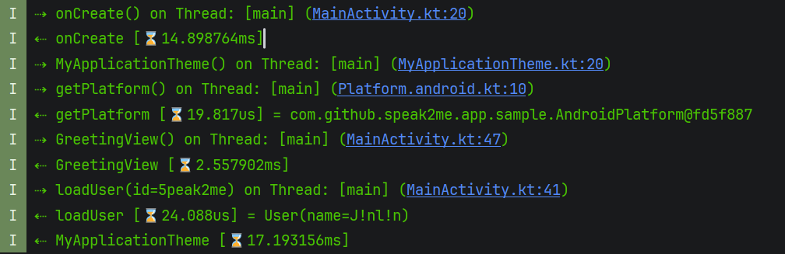

# kcp-tracing [](https://plugins.gradle.org/plugin/io.github.5peak2me.kcp.tracing)


[](https://kotlinlang.org)
[](https://developer.android.com/build/releases/gradle-plugin)
[-(?:bin|all).zip&replace=$1&label=Gradle&color=blue&logo=gradle)](https://gradle.org)
[](https://docs.gradle.org/current/userguide/configuration_cache.html)

Add the plugin to each Kotlin, Android, or Kotlin Multiplatform module that should be traced.

## Output

Annotated functions log entry, exit, duration, thread, source location, parameters, and return values.



## Installation

You can add this plugin to your top-level build script using the following configuration:

### `plugins` block:

```groovy
plugins {
  id "io.github.5peak2me.kcp.tracing" version "1.0.0"
}
```
or via the

### `buildscript` block:
```groovy
apply plugin: "io.github.5peak2me.kcp.tracing"

buildscript {
  repositories {
    gradlePluginPortal()
  }

  dependencies {
    classpath "io.github.5peak2me.kcp.tracing:gradle-plugin:1.0.0"
  }
}
```

By default, the Gradle plugin automatically adds the annotations dependency and uses:

```kotlin
import com.github.speak2me.kcp.tracing.annotations.Tracing
```

```kotlin
@Tracing(parameter = true, `return` = true)
fun loadUser(id: String): User = TODO()
```

If you want to use your own source-retained annotation, configure its fully qualified name:

```kotlin
package com.example

@SinceKotlin("1.9")
@Target(
  AnnotationTarget.CLASS,
  AnnotationTarget.CONSTRUCTOR,
  AnnotationTarget.FUNCTION,
  AnnotationTarget.EXPRESSION,
  AnnotationTarget.FILE,
)
@Retention(AnnotationRetention.SOURCE)
public annotation class Tracing(
  val parameter: Boolean = false,
  val `return`: Boolean = false,
  val thread: Boolean = true,
)

tracing {
  annotation = "com.example.Tracing"
}
```

When `tracing.annotation` is set, the plugin passes that annotation name to the compiler plugin and does not add the built-in annotations dependency automatically.

### Compatibility

Since Kotlin compiler plugins are an unstable API, certain versions of Confundus only work with
certain versions of Kotlin.

| Kotlin         | Confundus |
|----------------|-----------|
| 2.0.0 - 2.2.21 | 1.0.0     |

Kotlin versions newer than those listed may be supported but have not been tested.

---
Plugin based on the [Kotlin Compiler Plugin Template][template].

[template]: https://github.com/5peak2me/kotlin-compiler-plugin-template
[docs:plugin-description]: https://github.com/5peak2me/kotlin-compiler-plugin-template/README.md
